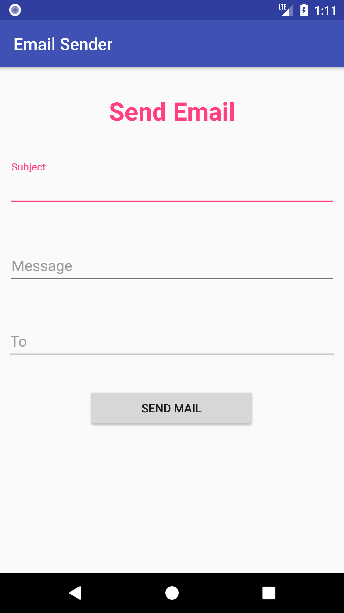
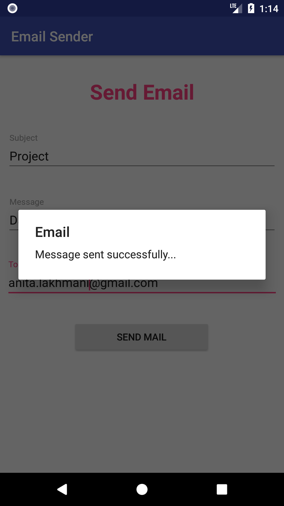

# Personal Email Sender
<h5>A Basic Email Sender Module.</h4>
<h5>A Php Script is Used in Backend.</h4>

<h1>Technologies Used</h1>
<ul>
<li>ANDROID Libraries</li>
<li>JAVA</li>
<li>PHP</li>
</ul>

<h1>Screenshots of App</h1>
<table>
  <tr>
    <th>  </th>
    <th>  </th>
  </tr>
</table>

<h1>Apk of App</h1>
<a href = "https://raw.githubusercontent.com/ashishlkhmn48/Email_Sender/master/images/emailsender.apk">Click to Download</a>
